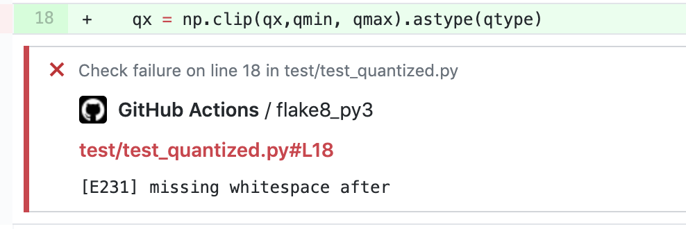

# `flake8` Github Action

This is a Github Action to run `flake8` against your repository.

It does fancy things like add annotations to your PRs inline.



Use it in your project like:

(in `.github/workflows/lint.yml`)

```yaml
name: Lint

on:
  push:
    paths:
      - '*.py'

jobs:
  flake8:
    runs-on: ubuntu-latest

    steps:
      - name: Setup Python
        uses: actions/setup-python@v2
        with:
          python-version: 3.9

      - name: Checkout
        uses: actions/checkout@v2

      - name: Install flake8
        run: pip install flake8

      - name: Run flake8
        uses: multani/flake8-github-action@v1
        with:
          check-name: flake8
```
